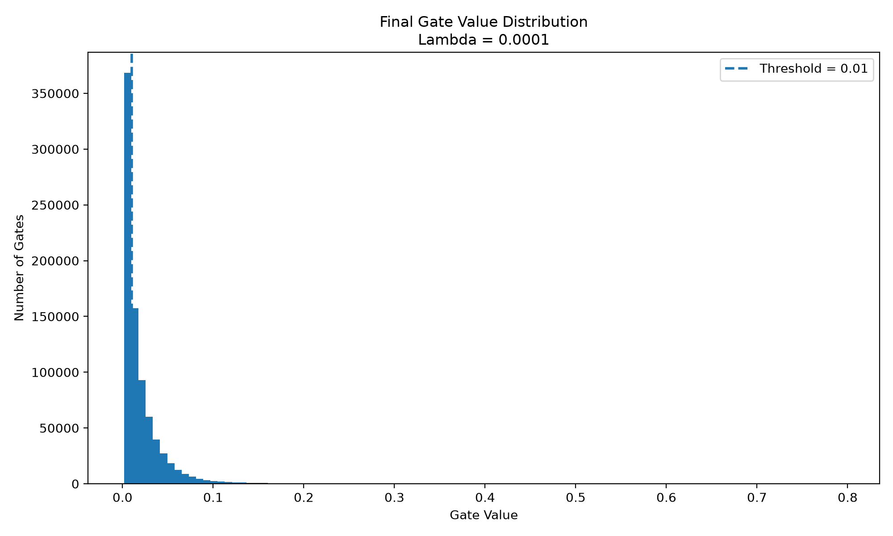
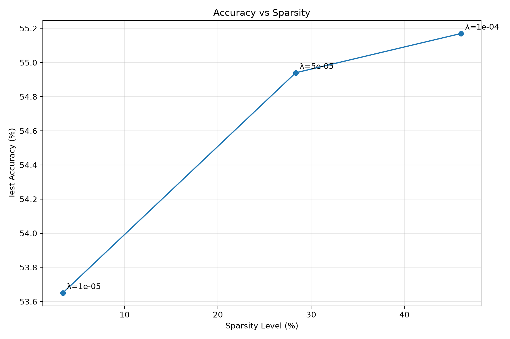

# The Self-Pruning Neural Network

## 1. Overview

This project implements a self-pruning feed-forward neural network for CIFAR-10 image classification. Each network weight is associated with a learnable gate that determines the effective importance of that connection.

The gate is calculated using a sigmoid transformation:

```text
G = sigmoid(S)
```

where `S` represents the learnable `gate_scores`.

The effective weight is:

```text
W_effective = W * G
```

where `*` represents element-wise multiplication.

The network learns both its weights and gate scores during training.

## 2. Prunable Linear Layer

A custom `PrunableLinear` layer was implemented instead of using `torch.nn.Linear` directly.

Each layer contains:

- `weight`
- `bias`
- `gate_scores`

The `gate_scores` tensor has exactly the same shape as the weight tensor and is registered as an `nn.Parameter`.

During the forward pass:

```text
G = sigmoid(gate_scores)
W_effective = W * G
output = W_effective * input + bias
```

The actual linear operation is implemented using PyTorch's `F.linear()` function.

Because sigmoid and element-wise multiplication are differentiable, gradients flow through both the weights and `gate_scores`.

## 3. Sparsity Regularization

The total training loss is:

```text
Total Loss = Classification Loss + lambda * Sparsity Loss
```

The classification loss is cross-entropy.

The sparsity loss is the L1 norm of all gate values:

```text
Sparsity Loss = sum(abs(G))
```

Since sigmoid gates are positive:

```text
Sparsity Loss = sum(G)
```

Therefore:

```text
Total Loss = CrossEntropyLoss + lambda * sum(G)
```

The L1 penalty encourages unnecessary gates to become small because reducing an unimportant gate decreases the sparsity penalty without significantly increasing the classification loss.

A larger lambda applies stronger pressure toward smaller gate values.

## 4. Network Architecture

CIFAR-10 images have dimensions:

```text
3 x 32 x 32
```

After flattening:

```text
3 x 32 x 32 = 3072 features
```

The network architecture is:

```text
3072 -> 256 -> 128 -> 10
```

All three fully connected layers use the custom `PrunableLinear` layer.

## 5. Experimental Setup

| Parameter         |                    Value |
| ----------------- | -----------------------: |
| Dataset           |                 CIFAR-10 |
| Architecture      | 3072 -> 256 -> 128 -> 10 |
| Optimizer         |                     Adam |
| Learning Rate     |                    0.001 |
| Batch Size        |                      128 |
| Epochs            |                       30 |
| Pruning Threshold |                     0.01 |
| Lambda Values     |         1e-5, 5e-5, 1e-4 |

A separate model was trained from the same initialization for each lambda value.

The sparsity level was calculated as the percentage of gates satisfying:

```text
gate < 1e-2
```

The final test accuracy was measured after applying hard pruning using this threshold.

## 6. Results

| Lambda | Test Accuracy (%) | Sparsity Level (%) |
| -----: | ----------------: | -----------------: |
|   1e-5 |             53.65 |               3.37 |
|   5e-5 |             54.94 |              28.34 |
|   1e-4 |         **55.17** |          **46.07** |

The complete results are stored in:

```text
results/results.csv
```

## 7. Lambda Trade-off Analysis

Increasing lambda resulted in a substantial increase in sparsity:

```text
3.37% -> 28.34% -> 46.07%
```

This demonstrates that the sparsity regularization successfully encourages the network to reduce the values of its gates.

The highest lambda value, `1e-4`, produced the highest observed sparsity of **46.07%** while achieving a hard-pruned test accuracy of **55.17%**.

Interestingly, test accuracy did not decrease as lambda increased in the tested range. Instead, it increased slightly from 53.65% to 55.17%. This indicates that the connections being suppressed in these experiments were not essential to classification performance.

A larger lambda could potentially produce even greater sparsity, but excessive regularization may eventually remove useful connections and reduce accuracy.

## 8. Gate Distribution

The best model was obtained using:

```text
Lambda = 1e-4
```

Its gate statistics were:

| Gate Statistic |   Value |
| -------------- | ------: |
| Minimum        | 0.00170 |
| Maximum        | 0.79555 |
| Mean           | 0.02176 |
| Gates < 0.01   | 377,979 |
| Gates < 0.10   | 801,320 |
| Gates < 0.25   | 815,603 |

The minimum gate value of approximately 0.0017 is below the pruning threshold of 0.01, demonstrating that the network successfully learned gates that can be pruned.

The gate distribution contains many values close to zero while retaining larger gate values for important connections.

### Gate Distribution Plot



## 9. Accuracy-Sparsity Visualization

The accuracy-sparsity relationship is visualized below.



The plot demonstrates the change in classification accuracy as progressively stronger sparsity regularization is applied.

## 10. Important Observation About Sigmoid Gates

A sigmoid output is strictly between 0 and 1:

```text
0 < sigmoid(S) < 1
```

Therefore, sigmoid gates do not mathematically become exactly zero during normal differentiable training.

For practical pruning, the specified threshold of `1e-2` is used:

```text
gate < 0.01 -> pruned
gate >= 0.01 -> retained
```

This allows the network to remain differentiable during training while producing a discrete pruned model during final evaluation.

## 11. Conclusion

The experiment demonstrates that a neural network can learn to suppress unnecessary connections using learnable sigmoid gates and L1 sparsity regularization.

Increasing the sparsity coefficient from `1e-5` to `1e-4` increased the measured sparsity from **3.37% to 46.07%**.

The best result obtained in the experiments was:

```text
Test Accuracy = 55.17%
Sparsity = 46.07%
```

This demonstrates a successful accuracy-sparsity trade-off and shows that the model can learn which of its connections are less important during training.
